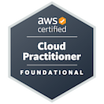
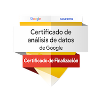

 Hi there 👋

- [1. About me](#1-about-me)
- [2. What I've learned](#2-what-ive-learned)
  - [2.1. Version control](#21-version-control)
  - [2.2. Python3](#22-python3)
    - [2.2.1. Tools](#221-tools)
    - [2.2.2. Data](#222-data)
    - [2.2.3. Machine learning](#223-machine-learning)
    - [2.2.4. Web](#224-web)
  - [2.3. Javascript](#23-javascript)
    - [2.3.1. Front end](#231-front-end)
    - [2.3.2. Backend](#232-backend)
  - [2.4. Databases](#24-databases)
    - [2.4.1. SQL](#241-sql)
    - [2.4.2. No SQL](#242-no-sql)
  - [2.5. Java](#25-java)
  - [2.6. Cloud](#26-cloud)
    - [2.6.1. AWS](#261-aws)
    - [2.6.2. Azure](#262-azure)
  - [2.7. BI Tools](#27-bi-tools)

# 1. About me

Hi, I'm from México. I studied a electroninc engineering and after go for a M.S. in  computer science.

I was working for manufacturing companies about 2 years in areas like quality. In this areas I did many things some related to technology like manage data and make reports no further than that and other no related like manage 8 people team to supervise production processes and training. After applied to study a M.s in C.S. and was admitted, previously I've talked with my boss and trained 2 people to take my place. They offered to me stay raising my salary and giving me a better position, but I really like the tech area so I still think was the best desition.

I've learning many things related with data and its manipulation.
Mainly I've focused to learn python and many tool that work really well under this language. But I've find this is not enough and started to learn many thing realated with web development and cloud becuase these abilities are almost mandatory to work in any field in these days. 

- 🔭 I’m currently working in data manage and how to connect this services together.
- 🌱 I’m currently learning web devopment and API creation to manage and provide services through these.
- 👯 I’m looking to collaborate on machine learning proyects and web devepment. The web devepments that I'm working on is react with DJango
- 📫 How to reach me: You can send a email to IsraelRescalvo@outlook.com

    
    

# 2. What I've learned

##  2.1. Version control
I think this tool is magnificent and mandatorial to this activity. It let you control and debug new features in your code and compare different commits to rapidly see differences between changes.

  * `git`, `git-hub`
## 2.2. Python3
I've been working since version 3.6 onwards. Mainly focused with data and its manipulation. Also I've learning how to implement APIs with DJango.

I like to work with `pyenv` to manage my python version and dev enviroments for every project. And recently I found `poetry` a tool that let you manage your project in `npm` way with a `.toml` file to configurate all your project dependencies.

For formatting I found very useful to use `black` integrated with `vscode`. 

### 2.2.1. Tools
* `black`, `pyenv`, `poetry`.

### 2.2.2. Data
* `pandas`, `numpy`, `matplotlib`, `seaborn`.

### 2.2.3. Machine learning 
I've working with some model developed under these modules:
* `PyTorch`, `Skearn`, `NLTK`, `Keras`.
* `Jupyterlab`: I think this is ok to show a model but not to develop. I've been facing that debug in this is very hard and variables are stick around until the kernel is restarted.

### 2.2.4. Web
My incoursion to web related things it's relative new but I'm focus on `DJango`.
* `DJango`

## 2.3. Javascript
I've been working recently with Javascript mainly learning how to develop full stack abilities. I learned to use `npm` for manage the project and install the required modules.

### 2.3.1. Front end
* `React`
### 2.3.2. Backend
* `Express`
  

## 2.4. Databases
I started manage databases to comprehend how this work with applications.

### 2.4.1. SQL
I took courses to be data analist in this tool. I've been working with MySQL and PostgreSQL directly and through ORM tools like the `DJango` provided or  `SQLAlquemy`.

* `PostgreSQL`, `MySQL`.

### 2.4.2. No SQL
With this tool I think is very easy to work and let you to do many things.

* `MongoDB`

## 2.5. Java

With this language I have foundational knowledge mainly focused in understand and read code maybe do sutils changes to it. I'm very fresh on it and learn throug read the marvellous book **Core Java**.

## 2.6. Cloud

I been in touch with cloud taking courses and trying to develop appliations on it. I've worked with AWS and Azure.

### 2.6.1. AWS
In AWS I have the **AWS Cloud Practitioner certification** taken in December 2022 valid to december 2025.

### 2.6.2. Azure
In this cloud I'v been inrolled in two courses that manages this cloud platform.

* Azure security technologies - August 2022 (given by Microsoft Team)
* Launch X (full stack course to develop in the cloud) - October to December 2022 (given by the Microsoft team.)

## 2.7. BI Tools
As I was working in manufacturing companies I found to  use this kind of tools are suited in somepoint to my perfil because let you manipulate data to make analysis and are very well adopted by the entreprises.

* PowerBI
* Tableu

